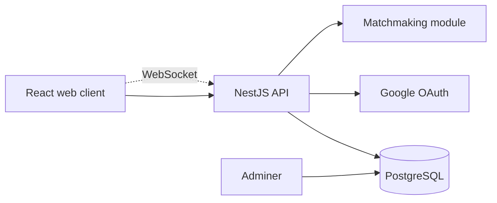
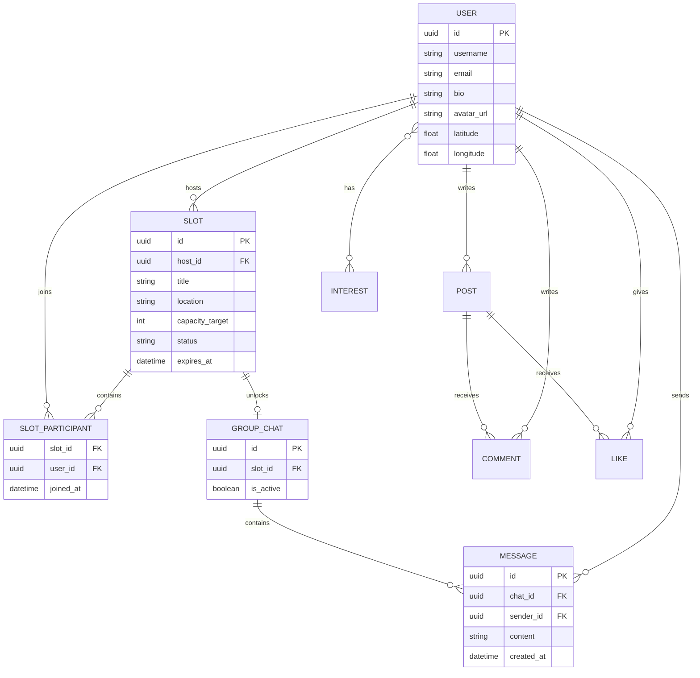

# wemeet

> A social platform that turns online connections into real-world meetups.

**wemeet** is a social media platform built around temporary real-life meetups called **Slots**. Users can create or join an activity, discover people with shared interests, and unlock a temporary group chat when a Slot reaches its target capacity.

The goal is simple: spend less time isolated behind a screen and make it easier to meet people in real life.

## Contents

- [Product vision](#product-vision)
- [Core features](#core-features)
- [Architecture](#architecture)
- [Technology](#technology)
- [Team](#team)
- [Getting started](#getting-started)
- [Environment variables](#environment-variables)
- [Git workflow](#git-workflow)
- [Definition of done](#definition-of-done)
- [Roadmap](#roadmap)

## Product vision

Traditional social media keeps people connected digitally without necessarily helping them meet. wemeet addresses that gap with a lifecycle-based meetup system:

1. A host creates a Slot for an activity, place, time, and participant capacity.
2. Other users discover the Slot and join it.
3. When the Slot is full, its temporary group chat becomes available.
4. The group uses the chat to coordinate the meetup.
5. After the meetup, the Slot and its chat are closed or archived.

## Core features

### Profiles and user management

- Google authentication
- Profile avatar, bio, and interests
- User discovery and follow suggestions
- Privacy-aware account and profile management

### Slots

- Create a location-based activity with a title, time, capacity, and expiry
- Browse open Slots and see live participant counts
- Join or leave a Slot while it is open
- Host controls and Slot lifecycle states: `OPEN`, `FULL`, and `CLOSED`

### Temporary group chat

- Chat is tied to one Slot
- Chat becomes available when the Slot reaches capacity
- Real-time messages and participant updates
- Chat is closed or archived with the Slot

### Social feed

- Create and browse posts
- Like and comment on posts
- View author profiles and interests
- Discover people and activities beyond the main feed

### AI matchmaking

The first recommendation system will live inside the NestJS backend. It can score potential matches using:

- Shared interests
- Location or proximity
- Previous Slot activity and participation patterns
- Relevant profile information

Recommendations should be explainable to users, for example: "You both enjoy coding and coffee."

## Architecture



The backend owns authentication callbacks, users, Slots, feed content, chat authorization, WebSocket events, and recommendation logic. PostgreSQL is the source of truth for persistent data. Adminer is available for local database inspection.

### Main entities



## Technology

| Area | Choice |
| --- | --- |
| Frontend | React |
| Backend | NestJS |
| Database | PostgreSQL |
| Authentication | Google OAuth |
| Real-time communication | WebSockets |
| Local infrastructure | Docker Compose for PostgreSQL and Adminer |
| Package manager | npm |
| Runtime | Node.js 20 LTS |

## Team

| Teammate | Main responsibility |
| --- | --- |
| Ali | User management, frontend and backend |
| Ghita | Chat, AI, bootstrap, frontend and backend |
| Oumaima | Feed, frontend and backend |
| Marouane | Slots pages, frontend and backend |
| Salah | Support for user management and Slots |

To inspect Ali's current work, check out the branch:

```bash
git checkout alel-you
```

## Getting started

### Prerequisites

- Node.js 20 LTS
- npm
- Docker and Docker Compose
- A Google OAuth application for local development

### Clone the project

Replace the placeholder URL with the team's GitHub repository URL:

```bash
git clone <GITHUB_REPOSITORY_URL>
cd wemeet
```

### Install dependencies

Install dependencies in the frontend and backend directories:

```bash
cd backend
npm install

cd ../frontend
npm install
```

### Start local infrastructure

Start PostgreSQL and Adminer with Docker Compose:

```bash
docker compose up -d postgres adminer
```

Local services:

| Service | URL or address |
| --- | --- |
| Backend API | `http://localhost:3000` |
| Frontend | `http://localhost:3002` |
| PostgreSQL | `localhost:5432` |
| Adminer | `http://localhost:8080` |

The exact npm scripts will be added here when the frontend and backend package files are created:

```bash
# backend
npm run start:dev

# frontend
npm run dev
```

## Environment variables

Create a `.env` file from the project's future `.env.example`. Never commit secrets.

```env
DATABASE_HOST=localhost
DATABASE_PORT=5432
DATABASE_NAME=wemeet
DATABASE_USER=<local_database_user>
DATABASE_PASSWORD=<local_database_password>

GOOGLE_CLIENT_ID=<google_client_id>
GOOGLE_CLIENT_SECRET=<google_client_secret>
GOOGLE_CALLBACK_URL=http://localhost:3000/auth/google/callback

FRONTEND_URL=http://localhost:3002
```

## Git workflow

The `main` branch should remain stable. Every change follows this flow:

1. Start from an up-to-date `main` branch.
2. Create a branch connected to an issue:

   ```bash
   git switch main
   git pull origin main
   git switch -c feature/short-description
   ```

3. Keep commits focused and explain the reason for the change.
4. Push the branch and open a pull request.
5. Link the issue in the pull request description.
6. Get at least one teammate approval.
7. Resolve review comments and make sure checks pass.
8. Squash-merge the pull request into `main`.
9. Delete the branch after merging.

Use `feature/*` for new functionality. Bug-fix branch naming can be agreed by the team when the first fixes are added.

Useful commands:

```bash
git status
git switch main
git pull origin main
git switch -c feature/my-change
git add .
git commit -m "Describe the change"
git push -u origin feature/my-change
```

Do not commit `.env` files, passwords, OAuth secrets, generated build files, or large local database exports.

## Definition of done

A change is ready for review when:

- The feature works on the intended frontend and backend paths.
- Validation and authorization rules are implemented on the backend.
- Loading, empty, error, and success states are handled in the UI.
- Database changes include the required migration or schema update.
- Real-time events are authorized and do not leak another user's data.
- The change has been tested locally.
- The pull request explains what changed, how it was tested, and any known limitations.

## Roadmap

- [ ] Create the NestJS backend and React frontend structure
- [ ] Add PostgreSQL schema and migrations
- [ ] Implement Google authentication
- [ ] Implement profiles and interests
- [ ] Implement Slot creation, joining, capacity, and expiry
- [ ] Add real-time Slot updates
- [ ] Unlock temporary chat when a Slot is full
- [ ] Implement posts, comments, and likes
- [ ] Add explainable matchmaking recommendations
- [ ] Add automated tests and CI checks
- [ ] Deploy a first shared development environment

## Project status

This project is under active development. Architecture and responsibilities may evolve as the team implements and validates the first version.